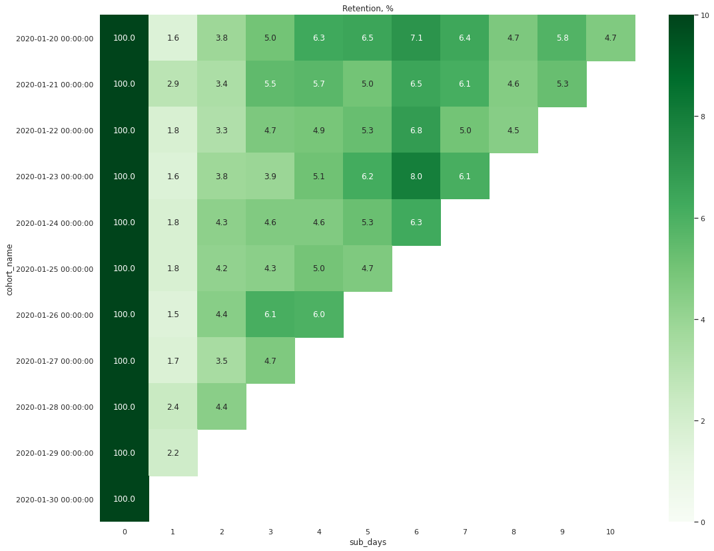
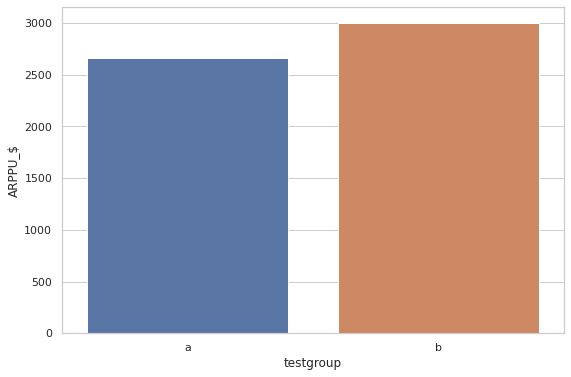
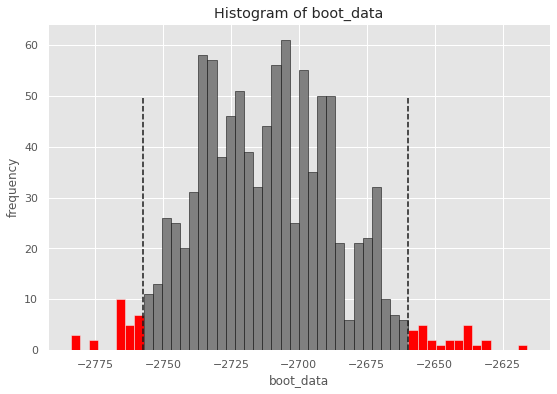
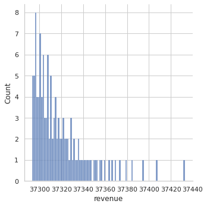

## В файле final_project.ipynb содержится код с решение выпускного проекта курса Аналитик Данных Karpov.Courses

## Задание 1. 
Имеются данные с ежедневной активностью пользователей мобильного приложения (мобильная игра). Нужно написать функцию на Python, которая будет расчитывать retention rate игроков (от даты регистрации до заданной даты). Результат визуализировать.

Решение: я получаю два датафрейма содержащих информацию с пользователями, их датами регистрации и датами последующих активностей. Я провожу подготовку данных, мерджу датафреймы в единый. Нахожу крайние даты регистраций и авторизации. После я пишу функцию которая распределяет пользователей по когортам и считает их retention rate по заданному периоду. В качестве аргументов функции указывается интересующий датафрейм и задается интересующий временной период. Retention по интересующим датам визуализируется в виде таблицы

## Задание 2.
Имеются результаты A/B теста, в котором двум группам пользователей предлагались лазличные наботы акционных предложений. Известно, что ARPU в тестовой группе выше на 5%, чем в контрольной. При этом в контрольной группе 1928 игроков из 202103 оказались платящими, а в тестовой - 1805 из 202667. Определите какой из наборов предложений оказался лучше. Расчитайте метрики котороые помогут проанализировать предложения.

Решение: я получаю датафрейм содержащий информацию по покупкам двух разных групп клиентов: контрольной и тестовой. Я провожу предварительный анализ данных и готовлю данные к последующей обработке. Высчитываю необходимые продуктовые метрики: конверсию (CR), средний доход с пользователя (ARPU), средний доход с платящего пользователя (ARPPU), нахожу различия показателей в группах. Провожу статистические тесты и определяю, что разница между группами является статистически значимой. Далее я провожу проверку восьми гипотез статистическими методами. Поскольку распределения в группах оказались ненормальными и имеют разную дисперсию для тестирования я применял бутстрап статистику. Проверив гипотезы, в целом новый набор предложений для тестовой группы оказался более выгоден. Однако, не владея информацией о том какие затраты требуются на выкатывание нового набора предложений на весь сервис в данный момент я предлагаю продолжить работу сервиса с прежним набором

   

## Задание 3.
В мобильной игре каждый месяц проводятся тематические события, ограниченные по времени. В них игроки могут получить уникальные предметы. Для их получения игрокам требуется пройти ряд уровней за определенное время. С помощью каких метрик можно оценить результаты последнего прошедшего события

Решение: в третьем задании я объясняю какие бы метрики использовал для текущих задач, а именно: количество уникальных пользователей, отзывы, среднее продолжительность сессии, возврат уже пользователей в игру, затраты на превлеченных пользователей в период события.
